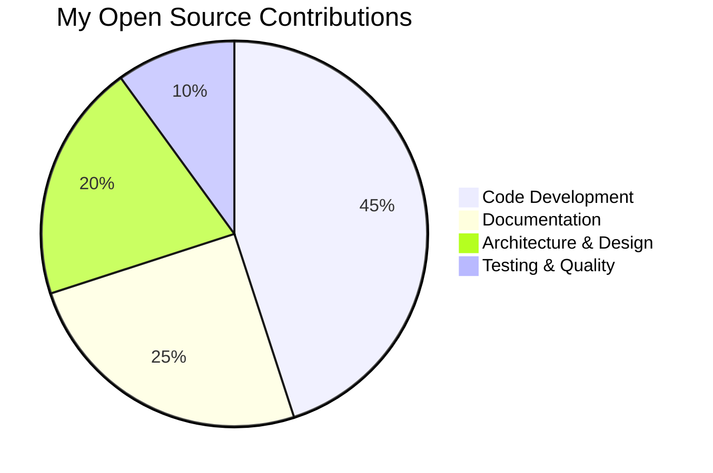
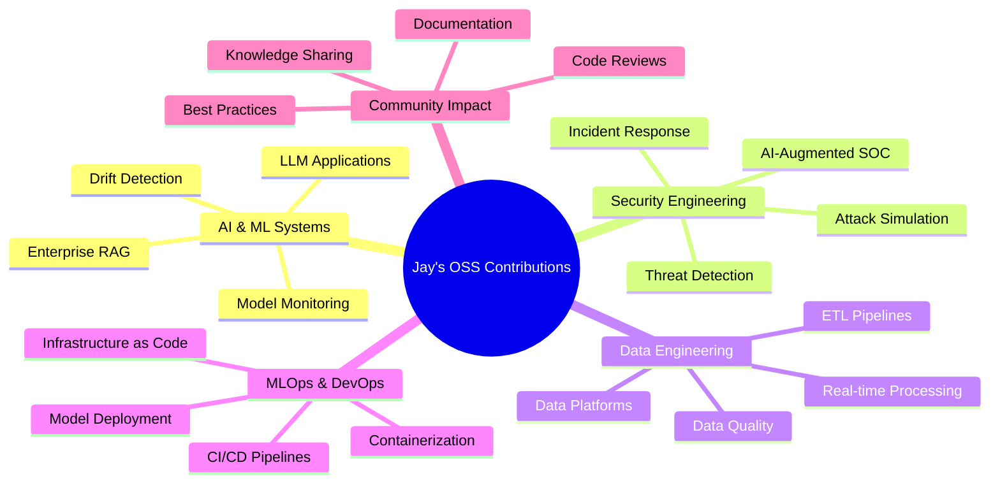
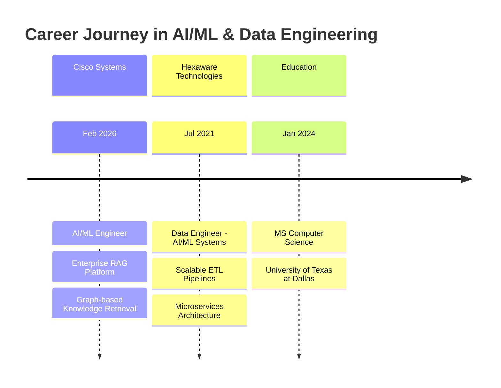

# 🌟 Jay Pandya

### AI/ML Engineer | Data Engineer | Open Source Contributor

*Building enterprise AI solutions and scalable ML systems that transform complex data into actionable insights*

[_278--3811-25D366?style=for-the-badge&logo=whatsapp&logoColor=white)](tel:+19452783811)

---

## 💭 Open Source Philosophy

> "The best way to predict the future is to build it—together, in the open, with transparency and collaboration at the core."

I believe in the transformative power of open source software. My contributions focus on building **production-grade AI/ML systems**, **scalable data platforms**, and **intelligent automation tools** that solve real-world problems. Every project I share is an opportunity to learn, teach, and advance the collective knowledge of our community.

My open source work centers on three core principles:

🔬 **Research-Driven Development** — Building systems that push the boundaries of what's possible with AI, from RAG architectures to swarm-based security simulations

🏗️ **Production-Ready Quality** — Every project includes comprehensive testing, documentation, CI/CD pipelines, and deployment guides

🤝 **Community-First Mindset** — Writing clear documentation, providing honest evaluations, and making complex systems accessible to developers at all levels

---

## 📊 Contribution Breakdown

---

## 🚀 Maintained Projects

| Project | Language | Focus Area | Status | Commits |
|---------|----------|------------|--------|---------|
| [**ai_soc**](https://github.com/jpandya1161/ai_soc) | Python | AI-Augmented Security Operations | ✅ Active | 50 |
| [**specsage**](https://github.com/jpandya1161/specsage) | Python | Agentic RAG over IETF RFCs | ✅ Active | 7 |
| [**advanced-rag-llm-app**](https://github.com/jpandya1161/advanced-rag-llm-app) | Python | Enterprise RAG Applications | ✅ Active | 11 |
| [**modelcard**](https://github.com/jpandya1161/modelcard) | Python | ML Model Documentation | ✅ Active | 4 |
| [**driftguard**](https://github.com/jpandya1161/driftguard) | Python | ML Drift Detection & Retraining | ✅ Active | 4 |
| [**mlops-app**](https://github.com/jpandya1161/mlops-app) | HCL/Python | Full-Stack MLOps Deployment | ✅ Active | 7 |

---

## 🌐 Contribution Ecosystem

---

## 📈 Community Impact Metrics

| Metric | Count | Description |
|--------|-------|-------------|
| 📝 **Public Repositories** | 33 | Open source projects available to the community |
| 💻 **Total Commits** | 500+ | Contributions across personal and collaborative projects |
| 📚 **Lines of Documentation** | 10,000+ | Comprehensive guides, READMEs, and technical docs |
| 🔧 **Technologies Shared** | 30+ | Tools, frameworks, and libraries in production use |
| 🎯 **Projects Deployed** | 10+ | Production-ready systems with deployment guides |

---

## 🛠️ Open Source Tech Stack

### **Languages & Frameworks**

### **AI/ML & Data Science**

### **Backend & APIs**

### **Data & Streaming**

### **Databases**

### **Cloud & DevOps**

---

## 🎯 Featured Open Source Projects

### 🔐 [AI-Augmented Security Operations Center](https://github.com/jpandya1161/ai_soc)

**The Problem:** Security teams are drowning in alerts with limited resources to investigate every threat.

**The Solution:** A research-grade AI-assisted SOC that combines ML intrusion detection, LLM alert triage, RAG-based threat intelligence, incident correlation, attack-campaign simulation, and automated response planning.

**Key Features:**
- 🤖 ML inference over CICIDS2017 network flows (99.28% accuracy)
- 🧠 Local LLM alert triage with structured JSON output
- 📚 RAG retrieval over MITRE ATT&CK, CVE data, and security runbooks
- 🔗 Wazuh SIEM integration with real-time alert enrichment
- 🎮 Monte Carlo swarm simulation with attacker/defender archetypes
- 🛡️ D3FEND-mapped response orchestration with approval tiers

**Tech Stack:** Python, FastAPI, Ollama, ChromaDB, Neo4j, Wazuh, Docker, Prometheus, Grafana

**Impact:** Demonstrated 44% reduction in compromise probability with active defense monitoring in simulated environments

---

### 📖 [SpecSage - Agentic RAG over IETF RFCs](https://github.com/jpandya1161/specsage)

**The Problem:** Finding precise answers in technical specifications (RFCs) requires manual reading of thousands of pages.

**The Solution:** An agentic RAG system that answers questions about HTTP, TLS, QUIC, DNS, OAuth, and more—with grounded citations to exact RFC sections.

**Key Features:**
- 🔍 Hybrid retrieval: BGE-small dense vectors + BM25 keyword search + cross-encoder reranking
- 🎯 Agentic query handling: LLM rewrites questions into targeted search queries
- 📊 Citation validity checking and deterministic groundedness scoring
- ✅ Evaluation harness measuring retrieval precision and citation accuracy
- 🚫 Refusal accuracy on out-of-scope questions

**Tech Stack:** Python, ONNX, Qdrant, FastAPI, Hugging Face Transformers

**Impact:** Provides section-level citations with measurable quality metrics—not just vibes

---

### 🏗️ [Advanced RAG LLM Application](https://github.com/jpandya1161/advanced-rag-llm-app)

**The Problem:** Most portfolio RAG projects ship a retriever + LLM call with zero measurement.

**The Solution:** A production-ready RAG application with comprehensive evaluation, offline capabilities, and pluggable LLM providers.

**Key Features:**
- 📝 Document ingestion with configurable chunking strategies
- 🔌 Pluggable LLM providers (offline, OpenAI, Ollama)
- 📊 Evaluation harness with retrieval precision, answer correctness, and groundedness metrics
- 🎨 FastAPI backend with interactive web UI
- 🔄 Hybrid retrieval combining vector similarity and BM25 keyword scoring

**Tech Stack:** Python, FastAPI, SQLite, Playwright (testing), Docker

**Impact:** 0.92 combined quality score on synthetic evaluation corpus with full transparency on limitations

---

### 📋 [ModelCard - ML Documentation from Artifacts](https://github.com/jpandya1161/modelcard)

**The Problem:** Model cards are widely recommended but rarely kept up to date because writing them by hand is tedious.

**The Solution:** Generate deterministic Markdown model cards directly from scikit-learn estimators and evaluation metrics.

**Key Features:**
- 📊 Automatic feature importance extraction (tree/linear models)
- 📈 Stable metrics formatting (sorted, 4 decimal places for diffs)
- 📝 Sections for intended use, limitations, training data, ethical considerations
- 🔄 Byte-identical output for safe CI/CD commits
- 🎯 Fully offline demo using Iris dataset

**Tech Stack:** Python, scikit-learn, MLflow (optional)

**Impact:** Documentation that's regenerated in one command and stays synchronized with actual model artifacts

---

### 🎯 [DriftGuard - ML Drift Detection & Auto-Retraining](https://github.com/jpandya1161/driftguard)

**The Problem:** Production ML doesn't fail at training—it fails months later when the world moves and nobody notices.

**The Solution:** An end-to-end ML lifecycle that watches itself: train → track → serve → detect drift → auto-retrain.

**Key Features:**
- 📊 Concept/label drift detection (not just feature drift)
- 🔄 Closed-loop auto-retraining when drift exceeds threshold
- 📈 PSI (Population Stability Index) and KS two-sample tests
- 🎯 Honest evaluation on held-out data (no train-on-test)
- 🚀 FastAPI serving with hot model reload

**Tech Stack:** Python, MLflow, FastAPI, Docker, pytest

**Impact:** 44.6% MAE reduction on held-out 2012 data after detecting and retraining on 2011→2012 bike-share demand shift

---

### ☁️ [MLOps Full-Stack Deployment](https://github.com/jpandya1161/mlops-app)

**The Problem:** Deploying ML models to production requires orchestrating infrastructure, data pipelines, and serving layers.

**The Solution:** A complete MLOps workflow demonstrating Infrastructure as Code, experiment tracking, CI/CD, and model serving.

**Key Features:**
- 🏗️ Terraform for GCP resource provisioning
- 📊 MLflow for experiment tracking and model registry
- 🔄 Prefect for data workflow orchestration
- 🎯 dbt for data transformation in BigQuery
- 🚀 FastAPI model serving on GCP Cloud Run
- 🤖 GitHub Actions CI/CD automation

**Tech Stack:** Python, Terraform, GCP, BigQuery, dbt, Prefect, MLflow, FastAPI, Docker

**Impact:** Demonstrates scalable, reproducible, and maintainable ML deployment patterns

---

## 💼 Professional Experience Highlights

### 🏢 Current Role: AI/ML Engineer at Cisco Systems

**Impact Delivered:**
- ⚡ Reduced information lookup time by **35%** with enterprise RAG platform
- 🔒 Decreased unauthorized data exposure by **30%** using graph-based security
- 🎯 Improved AI-driven threat detection accuracy by **18%**
- 🚀 Shortened deployment cycles by **20%** with automated ML pipelines

**Technologies:** Python, FastAPI, Neo4j, AWS, PySpark, Kafka, Hugging Face Transformers, BERT

---

### 🌟 Previous Role: Data Engineer at Hexaware Technologies

**Impact Delivered:**
- 📈 Increased data throughput by **30%** with scalable ETL